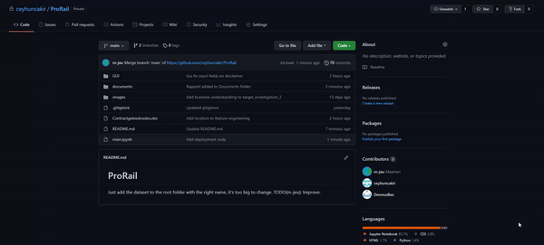
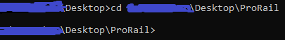
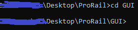
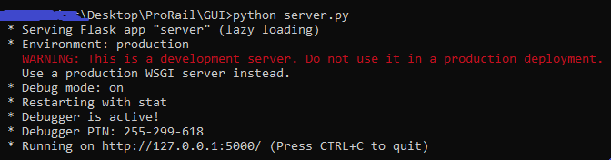
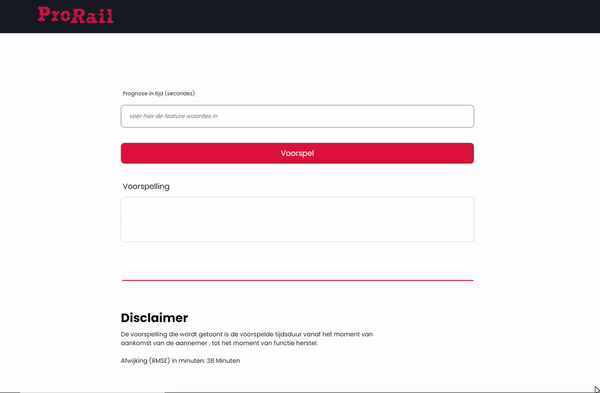

# ProRail
In dit github repo wordt er uitgelegd en getoond hoe we met behulp van data science een applicatie kunnen bouwen die een business probleem van ProRail kan oplossen. De probleemstelling die ProRail heeft is dat bij een melding van een probleem het vaak onduidelijk is wanneer het moment  van functieherstel zal plaatsvinden.

Om dit probleem op te lossen gaan we ook wat vertellen over de methodologie die we hebben gebruikt. Aan het einde van dit document zullen we onze bevindingen en eventuele aanbevelingen concluderen.

# Leden

```
Ceyhun Cakir | student nummer: 1784480 | Email: ceyhun.cakir@student.hu.nl
Maarten de Jeu | student nummer: 1792206 | Email: maarten.dejeu@student.hu.nl
Dennis Besselsen | student nummer: 1790749 | Email: dennis.besselsen@student.hu.nl
```

# Installatie
```
python-math (0.0.1) via (https://pypi.org/project/python-math/) 
Flask (2.0.2) via (https://pypi.org/project/Flask/)
Sklearn (0.24.1*) via (https://scikit-learn.org/stable/install.html)
Date (4.3) via https://pypi.org/project/DateTime/
```

# Instructies
```
1: Download de source code zip file.
```



```
2: Zorg dat je in het (Prorail) folder zit.
```



```
3: Zorg dat je daarna in het (GUI) folder zit
```


```
4: Type: (python server.py)
```


```
5: De webserver zou nu draaiend moeten zijn op localhost:5000!
```


# Versie
1.0.0 | 11-11-2021
